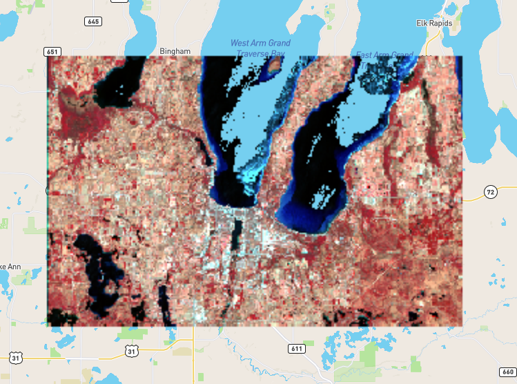

# GeoTiff Map Server with Mapbox Integration



## Overview

This repository contains sample code for setting up a server for Web Map Tile Service using Cloud Optimized GeoTiff. It allows users to visualize images comprehensively through Mapbox integration.

## Environment

The server is implemented in Python using FastAPI, Rasterio Tiler (rio-tiler), and Poetry. The front end is developed with TypeScript, React, and Vite.js.

## Prerequisites

Before getting started, ensure you have a Mapbox account and insert the API token into the `.env.local` file.

## Installation

### Server

1. Install Poetry if not already installed.
2. Navigate to the `server` directory.
3. Run the following commands:
   ```bash
   make install
   make start
   ```

### Web

1. Navigate to the `web` directory.
2. Run the following commands:
   ```bash
   npm install
   npm run dev
   ```

## Usage

Provide information on how to use the library and include any essential code snippets.

## Important Note

As Mapbox is utilized, it is crucial to create an account and insert the token into the `.env.local` file.

## License

This library is licensed under the [MIT License](LICENSE).
